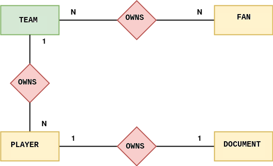

# Challenge requirements


# Challenge: Team Management System

You are one of the programmers involved in developing a system that manages sports teams. The client company provided a list of necessary requirements to carry out this type of management.

An entity-relationship diagram was created to help design the system, as shown below.




The client company informed us that the following data needs to be stored in the system:

+	**Team**
    * Identifier
    * Name
    * Players List
    * Fans List

+ **Player**
    * Identifier 
    * Name
    * Position
    * Document
    * The team which they work for

+ **Document**
    * Identifier
    * CPF
    * Work Card Number
	* CBF Number
	
**Attention:** *do not include* a reverse mapping between Document and Player (tha is, the Player has a Document, but the Document does not have a Player).

+ **Fan**
    * Identifier 
    * Name

Finally, it was defined that the identifier of each entity must be generated automatically by the system.

**Your task in this quest is to build a system, using the hibernate framework, in which it is possible perform CRUD operations (CREATE, READ, UPDATE, DELETE) to all the listed entities, accoriding to the raised specification.**

 Fot this, you will have to:

1. Create all Data Access Object (DAO) classes
2. Create all Entity classes

### Hints
1.  Review the entity relationship diagram and see which classes you will need to create.
2. Analyze the relationship between the entities, based on it you will choose the hibernate annotations that will be needed:

```java
@OnetoOne
@OneToMany
@ManyToOne
@ManyToMany
```

3. As a good practice, make different layers for accountability. For example, use a package called dao for classes that represent the Data Access Object.
4. Use the concept of Inheritance to implement Data Access Object classes.


After you implement this challenge, you will have gone through a process similar to building real-world systems, modeling the data, and building the operations to access it. Cool huh? #LETSGO

---